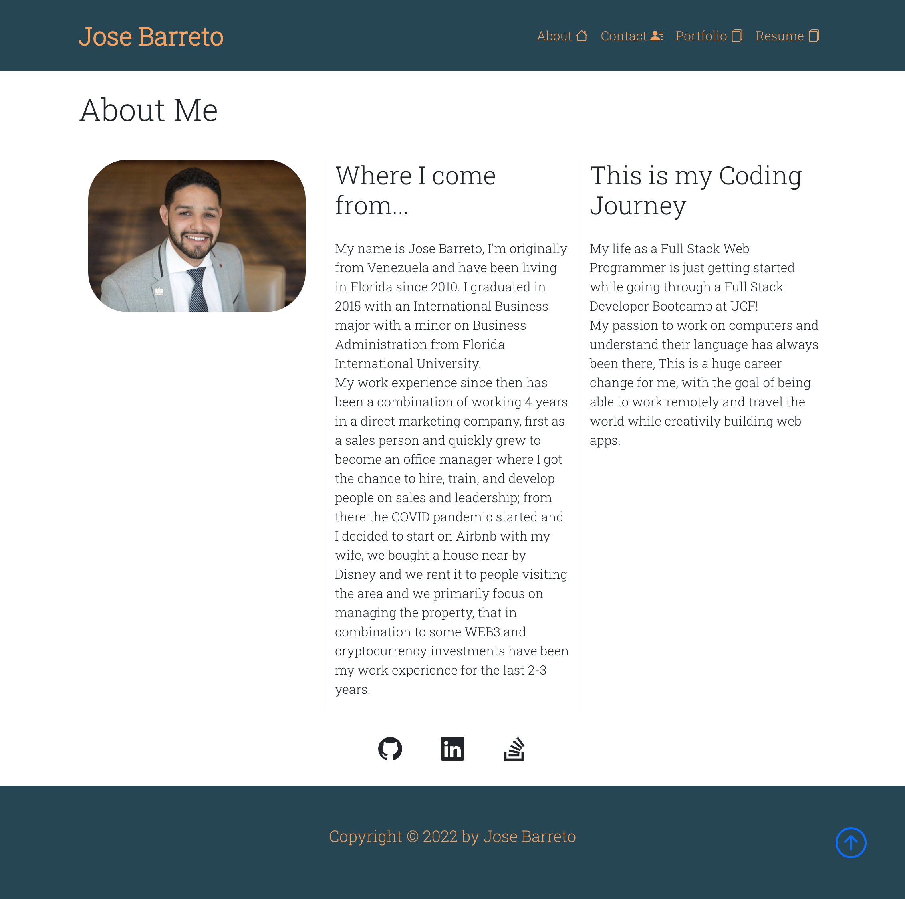

<p id="readme-top"></p>

[](https://opensource.org/licenses/MIT)
  # React Portfolio
  
 
  * [Installation](#installation)
  * [Description](#description)
  * [Usage](#usage)
  * [Contribution](#contribution)
  * [License](#license)
  * [Questions](#questions)
      
  ## Installation

    As a programmer:

  1. Git clone.
  2. install node.js.
  3. Command line (npm install) to install neccesary modules located on package.json.
  4. Command Line (npm run start) to initialize the app and listen to port 3001.
  5. Use your favorite browser to check on localhost:3001/

 <p align="right">(<a href="#readme-top">back to top</a>)</p>
    

  ## Description

  This application is a Portfolio using React that displays information about myself, my projects and contact information.

   <p align="right">(<a href="#readme-top">back to top</a>)</p>

  ## Usage

  Must have [Node.js](https://nodejs.org/en/) downloaded!


  As a programmer:
```sh 
    Install neccesary modules using the Command line -> npm install
``` 
```sh 
    Command line to start application -> npm run start
```
```sh 
    Use favorite browser to check localhost:3001/
```
 As a user:
 ```sh 
    https://joseobm92.github.io/React-Portfolio/
```


 <p align="right">(<a href="#readme-top">back to top</a>)</p>

  ## Contribution

  N/A

  ## Demo



 <p align="right">(<a href="#readme-top">back to top</a>)</p>
 
  ## License
  This project is licensed under the [The MIT License](https://opensource.org/licenses/MIT)
   <p align="right">(<a href="#readme-top">back to top</a>)</p>
      
  ## Questions
  * Checkout my [GitHub profile](https://github.com/joseobm92)
  
  * Any additional questions or feed back, feel free to [send an email](mailto:joseobm92@gmail.com). 
   <p align="right">(<a href="#readme-top">back to top</a>)</p>
 
